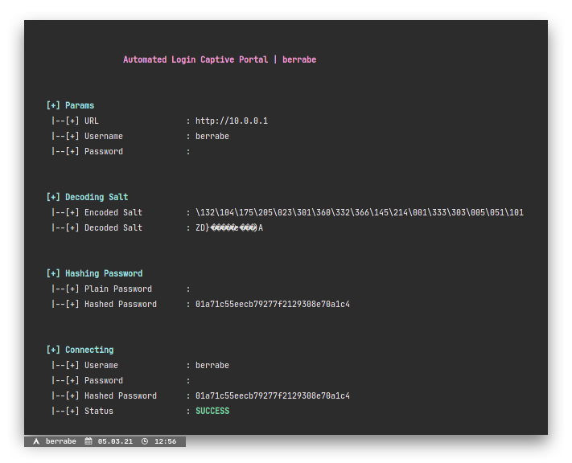

<p align="center">
  
</p>

<br/><br/>

### 1 - INTRO
---
This shell script was built using bash version 5.1.0, useful for logging into the captive portal, especially the Mikrotik captive portal via cli instead of web browser.
By doing it in cli, you can do some automation, such as enumeration of registered users and passwords

<br/><br/>

### 2 - SETUP
---
the simple steps needed to use this script, all you have to do is download the script

```sh
> wget https://raw.githubusercontent.com/berrabe/autologin-captive-portal-mikrotik/master/mtk.sh
> chmod +x mtk.sh
> ./mtk.sh
```

<br/><br/>

### 5 - POC
---
<p align="center">
  <br/>
  <b>help page</b>
</p>

<br/><br/>

<p align="center">
  <br/>
  <b>Trying to Connecting to Captive Portal</b>
</p>

<br/><br/>

<p align="center">
  <br/>
  <b>Already Logged In</b>
</p>
